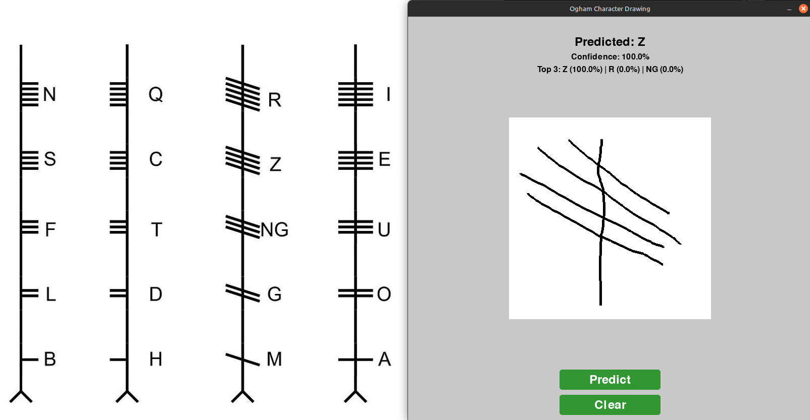

Repository containing files and source code for the CS4445 AI module's final capstone project.

## Installation/Pre-requisites

### Environment Setup
- Python 3.8 or higher
- pip package manager

### Required Libraries
```bash
pip install -r requirements.txt
```

### Running the Model
1. Clone the repository:
   ```bash
   git clone https://github.com/your-username/ai-project-team.git
   cd ai-project-team
   ```
2. Install dependencies as mentioned above
3. If you are planning to train a model run synthesise_data.py

4. Select the options:
- `--model`: Path to a custom trained model 
- `--image`: Path to the image you would like to run the defined model on
- `--labels`: Path to defined labels json file
- `--heatmap`: Define whether you want the heatmap of focus points or not

Example:
```bash
python model/client.py --model model/saved_model --image G.png --heatmap 
python model/client.py --model model/saved_model --image test.png --train
python model/client.py --model model/saved_model --image test.png --heatmap    
python model/client.py --model model/saved_model --image test.png --train --heatmap   
python model/client.py --model model/saved_model --image test.png --labels model/label_to_letter.json #only used if labels cannot be found 
```

## Drawing Interface

The project includes an interactive drawing interface that allows you to draw Ogham characters and get real-time predictions using the hybrid model:

```bash
python model/draw_interface.py
```

Features:
- Draw Ogham characters using your mouse
- Click "Predict" to get model predictions
- Shows confidence scores and top 3 predictions
- "Clear" button to reset the canvas
- Automatically resizes drawings to match model input size

Note: Ensure you have trained the model first using the commands above, as the interface requires `model/saved_model` and `model/label_to_letter.json` to be present.

## Demo

